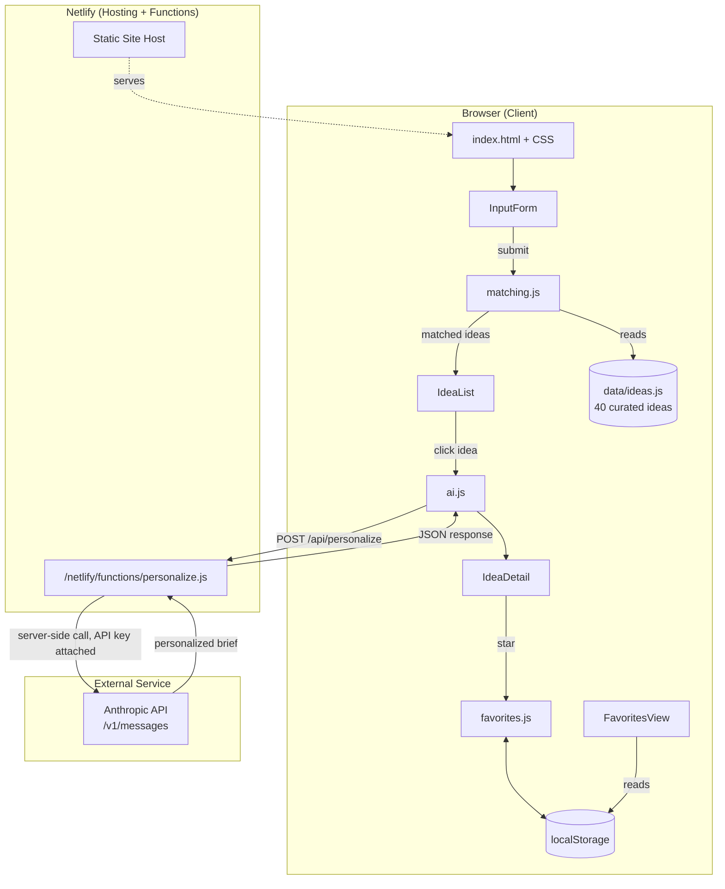
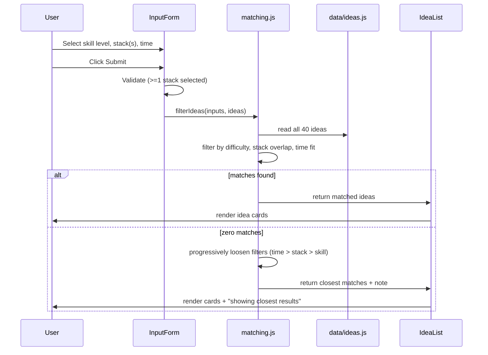
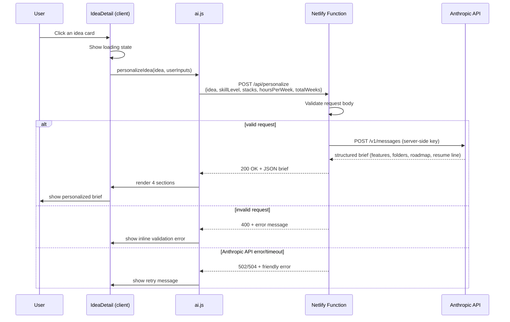

# Eager — System Architecture

Status: Locked Day 2. Do not redesign without flagging a conflict with the PRD.

## 1. Tech Stack

| Layer | Choice | Why |
|---|---|---|
| Frontend | Vanilla HTML/CSS/JS, ES modules, no build step | Simplest reliable path for a first dynamic app; no login/complex nested state to justify a framework |
| Backend | One serverless function only (`/netlify/functions/personalize.js`) | No accounts/auth needed (PRD §5.2); the only server-side need is hiding the Anthropic API key |
| Database | None — static `data/ideas.js` + browser `localStorage` | Idea bank is a version-controlled data file (PRD §9); favorites persist client-side only (PRD §5.1) |
| Authentication | None | Explicitly out of scope for v1.0 |
| AI Model/API | Google Gemini API (`gemini-2.5-flash`, free tier via Google AI Studio), called from the serverless function, never from the browser. **Switched from Anthropic Day 6** — the Anthropic Console account had $0 credit with no working free-tier path; Gemini's free tier needs only a Google account, no card. | Keeps the API key private in a publicly deployed static site; stays on a genuinely free tier |
| Hosting | Netlify | Free tier; static hosting + serverless functions on one platform, git-linked auto-deploy |
| Fonts | Google Fonts CDN — Hanken Grotesk (headings), Manrope (body), IBM Plex Mono (code/technical output) | Matches the "Precision Workshop" design system, zero install |
| Version control | Git + GitHub | Already set up (`github.com/charu-blabla/Eager`) |

**Environment variables:** `GEMINI_API_KEY` is set in the Netlify dashboard (Site settings → Environment variables), never committed to the repo. `.gitignore` already excludes `.env`.

## 2. Component Diagram

## 3. Data Flow — Matching (No Network Call)

Idea matching is entirely client-side. This keeps FR-5/FR-6/FR-7 instant and free.

## 4. Request Lifecycle — AI Personalization

## 5. External Services

| Service | Purpose | Notes |
|---|---|---|
| Anthropic API | Generates the personalized brief | Called only from the serverless function, never the browser |
| Netlify | Hosting + serverless functions + auto-deploy from GitHub | Free tier covers this project's traffic comfortably |
| GitHub | Source control, triggers Netlify deploys on push to `main` | Already set up |
| Google Fonts | Space Grotesk / Inter / IBM Plex Mono | Loaded via CDN `<link>` tag, no install |

## 6. Why No Database

The idea bank (40 entries) is small, fixed, and edited by Charu directly in code — a database would add setup, hosting, and query complexity with zero benefit at this scale (PRD §9, §5.2 — admin panel explicitly deferred to v2). Favorites are per-browser by design (PRD §5.1 — no accounts for v1), so `localStorage` is the correct persistence layer, not a database table.
