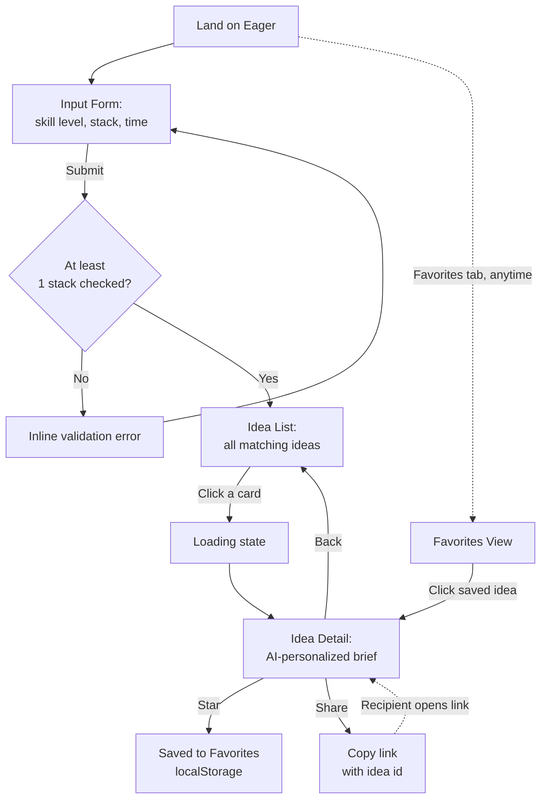

# Eager — UI & User Flow

Low-fidelity by design — Day 7 handles visual polish. Every screen below exists to serve a specific FR from the PRD; there are no extra screens.

## 1. User Flow Diagram



## 2. Screens (4 total — matches PRD Core User Flow §6)

| Screen | Exists Because |
|---|---|
| Input Form | FR-1–FR-4: collect skill/stack/time |
| Idea List | FR-5–FR-7: browse all matches |
| Idea Detail | FR-8–FR-10: personalized brief |
| Favorites | FR-11–FR-12: revisit saved ideas |

No dashboard, no settings, no onboarding screen — v1.0 scope stays exactly to what the PRD defines.

## 3. Low-Fidelity Wireframes

### Screen 1 — Input Form

```
┌──────────────────────────────────────────────┐
│  EAGER                          [Favorites ☆] │
│                                                │
│  Know what to build, in one click.            │
│                                                │
│  Skill Level                                  │
│  ( ) Beginner  ( ) Intermediate  ( ) Advanced  │
│                                                │
│  Tech Stack (select all that apply)           │
│  [ ] JavaScript   [ ] Python   [ ] React       │
│  [ ] Flutter      [ ] Java     [ ] HTML/CSS    │
│  [ ] ...                                       │
│                                                │
│  Time Available                               │
│  Hours/week: [ __ ]   Total weeks: [ __ ]      │
│                                                │
│              [   Find My Project   ]          │
└──────────────────────────────────────────────┘
```

### Screen 2 — Idea List

```
┌──────────────────────────────────────────────┐
│  ← Edit inputs               EAGER  [Favorites]│
│                                                │
│  12 ideas match your inputs                   │
│                                                │
│  ┌────────────────────────────────────────┐  │
│  │ [WEB]  Habit Tracker Dashboard      ☆   │  │
│  │ A visual habit tracker with streaks...  │  │
│  │ ~2 weeks                                │  │
│  └────────────────────────────────────────┘  │
│  ┌────────────────────────────────────────┐  │
│  │ [AI]  Resume Keyword Matcher        ☆   │  │
│  │ Compares a resume to a job post...      │  │
│  │ ~3 weeks                                │  │
│  └────────────────────────────────────────┘  │
│  ...                                          │
│                                                │
│  (if zero exact matches:)                     │
│  "No exact matches — showing closest results" │
└──────────────────────────────────────────────┘
```

### Screen 3 — Idea Detail (Personalized)

```
┌──────────────────────────────────────────────┐
│  ← Back to results         ☆ Favorite  ⤴ Share│
│                                                │
│  Habit Tracker Dashboard              [WEB]   │
│  A visual habit tracker with streaks...       │
│                                                │
│  ── Features ──────────────────────────       │
│  Must-Have:                                   │
│   • Log a habit as done for the day           │
│   • ...                                       │
│  Stretch Goals:                               │
│   • Weekly streak visualization               │
│                                                │
│  ── Folder Structure ── (monospace) ──        │
│  habit-tracker/                               │
│    index.html                                 │
│    js/main.js                                 │
│                                                │
│  ── Learning Roadmap ──────────────────       │
│  Week 1: Core logging + localStorage          │
│  Week 2: Streaks + weekly chart               │
│                                                │
│  ── Resume Description ───────────────        │
│  "Built a habit-tracking web app with..."     │
│                     [Copy]                    │
└──────────────────────────────────────────────┘
```

### Screen 4 — Favorites

```
┌──────────────────────────────────────────────┐
│  ← Back to Eager                    Favorites │
│                                                │
│  ┌────────────────────────────────────────┐  │
│  │ [WEB]  Habit Tracker Dashboard      ★   │  │
│  │ Saved Aug 2                              │  │
│  └────────────────────────────────────────┘  │
│                                                │
│  (if empty:)                                  │
│  "Nothing saved yet — star an idea to keep    │
│   it here."                                   │
└──────────────────────────────────────────────┘
```

## 4. Navigation Model

- Single-page app, no full page reloads between screens — view state managed in `main.js`
- "Favorites" is reachable from every screen via a persistent top-right link
- "← Back" always returns to the previous screen's exact state (list scroll position, form values retained)
- A shared link deep-links straight to Screen 3 (Idea Detail) on load, bypassing the form
